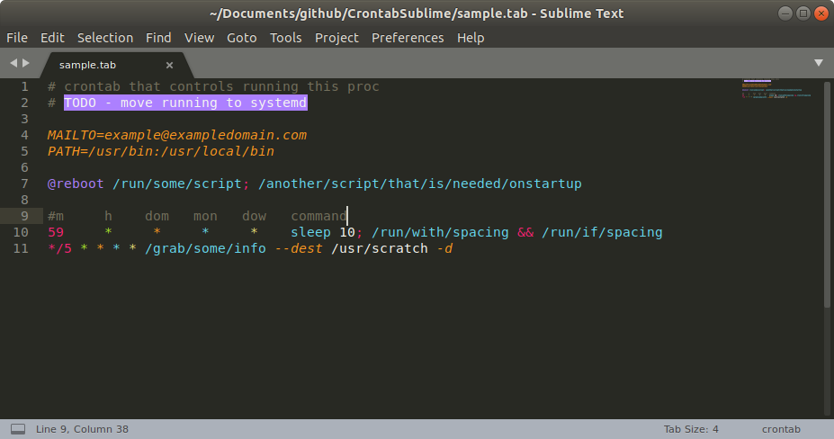

# CrontabSublime
version 0.1

A package I wrote for ST3 to syntax highlight Crontabs since the old package available (https://github.com/clarkewd/SublimeCrontab) has not beem updated since 2015 and doesn't work. I have inherited a regex, but intend to remove it's use in a future release as it's quite complicate and doesn't allow TODO 1 easily.

Crontabs are arguably a dying thing with systemd, but crontabs are still a quick and dirty way to get things running without too much effort, so some use is nice.

## Installation

1. Run “Package Control: Install Package” command, find and install `Crontab` plugin.
2. Close and reopen file

## Notes

- Will highlight packages with `tab` and `crontab` suffices. For custom suffices/filenames, add to your personal sublime text preferences.
- Uses bash highlighting in your commands.
- Comment and uncommenting lines using `ctrl/cmd + /` works as expected

## Todos

1. Report errors in syntax in the time string
2. Alert on unescaped usage of `%` in crontab line
3. Provide an autocomplete like syntax for inserting new command lines
4. Provide a template file of things to do when creating a crontab file
5. Highlight the valid `@` syntax uses and not all uses

